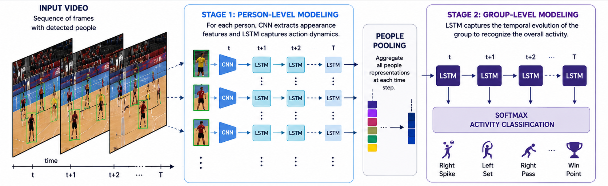
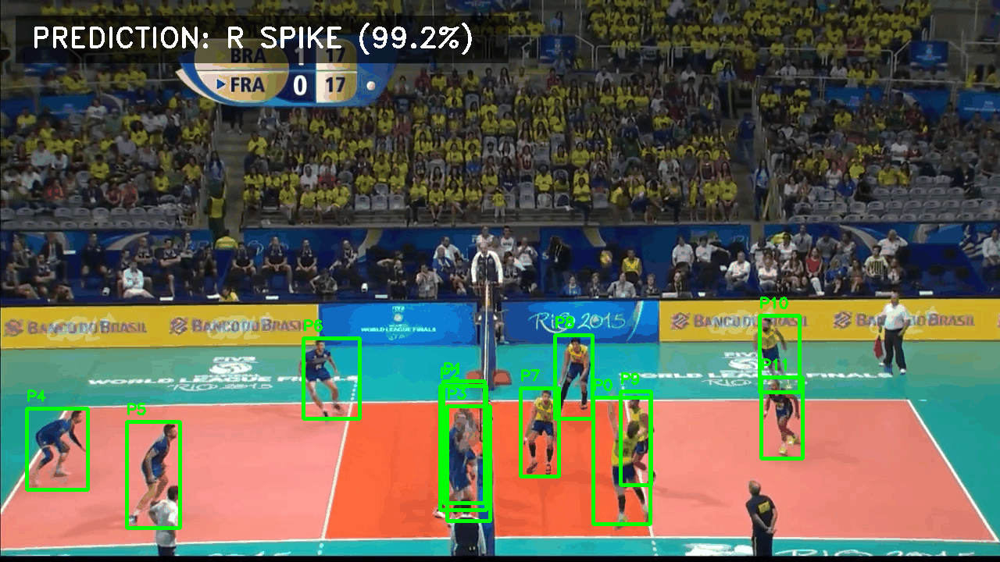
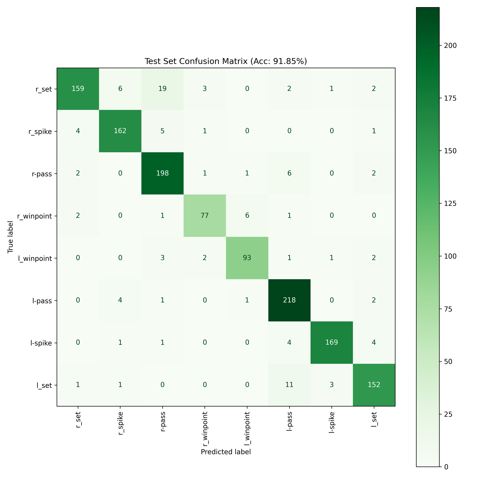

[//]: # (<div align="center">)

[//]: # (  )

[//]: # (</div>)

<h1 align="center">Hierarchical Deep Temporal Model for Group Activity Recognition</h1>

<p align="center">
  A modern, highly modular PyTorch implementation of the <strong>CVPR 2016 paper</strong>:<br>
  <a href="https://arxiv.org/pdf/1607.02643"><em>A Hierarchical Deep Temporal Model for Group Activity Recognition</em></a>
</p>

<p align="center">
 
</p>

<p align="center">
  
  
  

[//]: # (  )
  
  
  
</p>

---

## Project Overview

> This project hierarchically models **individual player actions** and **team-level dynamics** from volleyball footage using a two-stage ResNet50 + LSTM pipeline. The final model (Baseline 8) achieves **91.85% group activity accuracy** on the Volleyball dataset — up from **72.50%** for the single-frame spatial baseline, and **+9.95% above the original CVPR 2016 paper's benchmark**.

---

## Table of Contents

1. [Key Features](#key-features)
2. [Results](#results)
3. [Architecture](#Architecture)
4. [Getting Started](#getting-started)
5. [Project Structure](#project-structure)
6. [Dataset Overview](#dataset-overview)
7. [Ablation Study](#ablation-study)
8. [Cloud Training](#cloud-training)
9. [License](#license)

---

## Key Features

This repository upgrades the original 2016 Caffe implementation to modern standards:

- **Modern PyTorch Pipeline**: Upgraded the original 2016 Caffe architecture into a clean, modular, and easily extensible PyTorch implementation.
- **ResNet50 Backbone**: Replaced the legacy AlexNet with a ResNet50 feature extractor to capture significantly richer spatial representations.
- **Multi-Modal Pooling**: Fused both Max and Mean Pooling to capture both the dominant individual action and the overall team context.
- **Automatic Mixed Precision (AMP)**: Integrated PyTorch `GradScaler` and `autocast` to halve VRAM usage and roughly double training speed on modern GPUs.
- **Seamless Cloud-to-Local CI/CD**: Built-in environment detection (`env_utils.py`) auto-routes dataset paths and multiprocessing settings (`spawn` vs `fork`) for Kaggle, Colab, or local runs.

---

## Results

Group activity classification accuracy on the **Volleyball dataset test split**. The table compares the original 2016 paper's AlexNet/Caffe results against this repository's ResNet50 PyTorch reimplementation:

| Baseline | Description                            | Paper's Accuracy | My Accuracy | My F1 Score | Δ Accuracy |
|----------|----------------------------------------|:----------------:|:-----------:|:-----------:|:----------:|
| B1       | Single-frame classifier (spatial only) |      66.7%       |   72.50%    |    0.72     |   +5.8%    |
| B3       | Fine-tuned person crop pooling         |      68.1%       |   75.50%    |    0.76     |   +7.4%    |
| B4       | Full-frame LRCN (temporal)             |      63.1%       |   72.63%    |    0.73     |   +9.5%    |
| B5       | Person LSTM + frozen linear pool       |      67.6%       |   82.65%    |    0.82     |   +15.1%   |
| B6       | Group BiLSTM (no person LSTM)          |      74.7%       |   78.46%    |    0.78     |   +3.8%    |
| B7       | Full two-stage hierarchical model      |      80.2%       |   83.77%    |    0.83     |   +3.6%    |
| **B8**   | **Two-stage + sub-group pooling**      |    **81.9%**     | **91.85%**  |  **0.92**   | **+9.95%** |

> The PyTorch reimplementation consistently outperforms the original Caffe baselines across all stages, with the largest gains in person-level temporal modeling (B5: **+15.1%**). The final model surpasses the paper's SOTA by **+9.95%**, driven by the ResNet50 backbone, Center-Frame Spatial Anchoring, and Max+Mean feature concatenation.

> Paper scores sourced from Table 5 of the [original CVPR 2016 paper](https://arxiv.org/pdf/1607.02643).

Sample confusion matrix from Baseline 8:

<div align="center">
  
</div>

---

## Architecture
**For main models : B7, B8**

<div align="center">
  
</div>

The model operates in two hierarchical stages:

1. **Stage 1 — Person-Level Temporal Modeling:** Individual player bounding box crops are passed through a shared ResNet50 backbone frame-by-frame. The resulting feature sequences are fed into a Person LSTM that learns each player's action semantics over time.

2. **Stage 2 — Group-Level Temporal Modeling:** Per-player LSTM outputs are spatially pooled (with optional left/right sub-group splitting in B8) and passed as a timeline into a Group BiLSTM, which classifies the overall team activity.

---

## Getting Started

### Requirements

| Requirement   | Version               |
|---------------|-----------------------|
| Python        | 3.12+                 |
| PyTorch       | 2.10+                 |
| CUDA          | 12.8                  |
| GPU VRAM      | 16 GB recommended     |
| Training time | ~2–5 hrs per baseline |

### 1. Clone & Install

```bash
git clone https://github.com/Amr2054/Hierarchical-Deep-Temporal-Model-for-Group-Activity-Recognition.git
cd Hierarchical-Deep-Temporal-Model-for-Group-Activity-Recognition
pip install -r requirements.txt
```

### 2. Dataset Preparation

Download the [Volleyball dataset](https://github.com/mostafa-saad/deep-activity-rec) and place it under `data/`. Then parse the raw annotations into the optimized `.pkl` format:

```bash
python -m data.data_annot_loader
```

### 3. Train a Model

Run training scripts from the **root directory** using module execution, passing the corresponding YAML config:

```bash
# Baseline 4 — Full-frame temporal LRCN
python -m models.baseline_4.trainer --config configs/baseline_4.yaml

# Baseline 7 — Full two-stage hierarchical model
python -m models.baseline_7.trainer --config configs/baseline_7.yaml

# Baseline 8 — Final model with sub-group pooling
python -m models.baseline_8.trainer --config configs/baseline_8.yaml
```

All outputs — `.pth` weights, TensorBoard logs, and confusion matrices — are automatically saved to:

```
models/baseline_X/outputs/run_[timestamp]/
```

### 4. Monitor Training

```bash
tensorboard --logdir models/baseline_X/outputs/
```

### 5. Evaluate a Checkpoint

```bash
python -m models.baseline_8.test_model --config configs/baseline_8.yaml --checkpoint path/to/weights.pth
```

---

## Project Structure

```text
Hierarchical-Deep-Temporal-Model-for-Group-Activity-Recognition/
├── assets/                   # Images for README (header, architecture, demo GIF, etc.)
├── configs/                  # YAML files controlling all model/training parameters
│   ├── baseline_1.yaml
│   ├── baseline_3_phase_A.yaml
│   ├── baseline_3_phase_B.yaml
│   ├── baseline_4.yaml
│   ├── baseline_5_phase_A.yaml
│   ├── baseline_5_phase_B.yaml
│   ├── baseline_6.yaml
│   ├── baseline_7.yaml
│   └── baseline_8.yaml
├── data/                     # Data ingestion, pickling, and PyTorch Datasets
│   ├── box_annot.py
│   ├── data_annot_loader.py
│   └── data_loader.py        # Bounding Box, Frame-by-Frame, and Anchor-Sorted Datasets
├── utils/                    # Core engineering utilities
│   ├── env_utils.py          # Auto-detects Kaggle vs. local environments
│   └── helper.py             # Config parsers, seed setting, and logging formatters
├── models/                   # Architecture and training scripts
│   ├── train_utils.py        # Universal training/validation loop
│   ├── eval_utils.py         # Universal testing loop
│   ├── baseline_1/           # Static ResNet50 image classifier
│   ├── baseline_3/           # Spatial person & group classifier
│   ├── baseline_4/           # Full-frame temporal LRCN
│   ├── baseline_5/           # Person LSTM + deep-freeze linear pool
│   ├── baseline_6/           # Single-stage group BiLSTM (no person LSTM)
│   ├── baseline_7/           # Full two-stage model (person LSTM + group BiLSTM)
│   └── baseline_8/           # Two-stage model with left/right sub-group pooling
├── requirements.txt
└── README.md
```

---

## Dataset Overview

The [Volleyball dataset](https://github.com/mostafa-saad/deep-activity-rec) consists of publicly available YouTube volleyball videos with 4,830 annotated frames across 55 videos.

### Group Activity Labels

| Group Activity Class | Instances |
|---|---|
| Right set | 644 |
| Right spike | 623 |
| Right pass | 801 |
| Right winpoint | 295 |
| Left winpoint | 367 |
| Left pass | 826 |
| Left spike | 642 |
| Left set | 633 |

### Player Action Labels

| Action Class | Instances |
|---|---|
| Waiting | 3,601 |
| Setting | 1,332 |
| Digging | 2,333 |
| Falling | 1,241 |
| Spiking | 1,216 |
| Blocking | 2,458 |
| Jumping | 341 |
| Moving | 5,121 |
| Standing | 38,696 |

### Train / Validation / Test Split

| Split | Video IDs |
|---|---|
| Train | 1, 3, 6, 7, 10, 13, 15, 16, 18, 22, 23, 31, 32, 36, 38, 39, 40, 41, 42, 48, 50, 52, 53, 54 |
| Validation | 0, 2, 8, 12, 17, 19, 24, 26, 27, 28, 30, 33, 46, 49, 51 |
| Test | 4, 5, 9, 11, 14, 20, 21, 25, 29, 34, 35, 37, 43, 44, 45, 47 |

---

## Ablation Study

Each baseline isolates one architectural variable to show its contribution to final accuracy.

| Baseline | Key Idea | Spatial | Temporal | Person-Level | Group-Level |
|---|---|:---:|:---:|:---:|:---:|
| B1 | Single-frame ResNet50 | ✅ | ❌ | ❌ | ❌ |
| B3 | Pooled player crops | ✅ | ❌ | ✅ | ❌ |
| B4 | Full-frame LRCN | ✅ | ✅ | ❌ | ❌ |
| B5 | Person LSTM + frozen pool | ✅ | ✅ | ✅ | ❌ |
| B6 | Group BiLSTM only | ✅ | ✅ | ❌ | ✅ |
| B7 | Two-stage hierarchical | ✅ | ✅ | ✅ | ✅ |
| B8 | + Sub-group pooling | ✅ | ✅ | ✅ | ✅ |

**Baseline 1 (Image Classification)** — A purely spatial model using ResNet50 to classify group activity from a single static frame. Establishes the spatial-only ceiling.

**Baseline 3 (Fine-tuned Person Classification)** — ResNet50 extracts 2048-d features from individual player bounding boxes. Features are pooled across all players in a frame and fed to a classifier.

**Baseline 4 (LRCN)** — Introduces time. A 9-frame clip passes through ResNet50 frame-by-frame; the feature sequence is fed into an LSTM to capture group motion before classification.

**Baseline 5 (Temporal Person Features)** — Two-phase architecture. Phase A trains an LSTM to track individual player crops over 9 frames. Phase B freezes Phase A and pools the 12 player features into a final linear classifier using a Center-Frame Spatial Anchor to preserve left/right court orientation.

**Baseline 6 (Group-Only Temporal)** — Skips the person LSTM. Extracts spatial features for all 12 players, applies Max + Mean pooling to summarize team posture frame-by-frame, and passes the timeline into a Group BiLSTM.

**Baseline 7 (Full Two-Stage Hierarchical)** — Combines B5 and B6. Uses the Phase A Person LSTM for individual action semantics, applies frame-by-frame pooling, and feeds the temporal sequence into a Group BiLSTM.

**Baseline 8 (Sub-Group Pooling)** — Prevents the Group LSTM from confusing "Left Spike" vs "Right Spike" by introducing Anchor Frame X-axis Sorting — physically slicing the court in half to map players explicitly to Left Team and Right Team tensors before temporal tracking.

---

## Cloud Training

<details>
<summary><strong>Kaggle / Colab Setup Instructions</strong></summary>

This repository is designed to be edited locally (PyCharm / VSCode) and executed on cloud GPUs without path errors.

**Steps:**

1. Push your code to GitHub.
2. In a Kaggle Notebook, clone the repository:

```bash
!git clone https://github.com/Amr2054/Hierarchical-Deep-Temporal-Model-for-Group-Activity-Recognition.git
```

3. The internal `setup_environment()` call will automatically:
   - Detect the Kaggle kernel
   - Reroute dataset paths to `/kaggle/input/`
   - Write all outputs to `/kaggle/working/`
   - Set `num_workers` to prevent container deadlocks

4. Pull latest changes and train:

```bash
!git pull origin main
!python -m models.baseline_8.trainer --config configs/baseline_8.yaml
```

</details>

---

## License

This project is licensed under the [MIT License](LICENSE).

---

<p align="center">
  Built on top of the original work by <a href="https://github.com/mostafa-saad/deep-activity-rec">Mostafa Saad Ibrahim et al.</a>
</p>